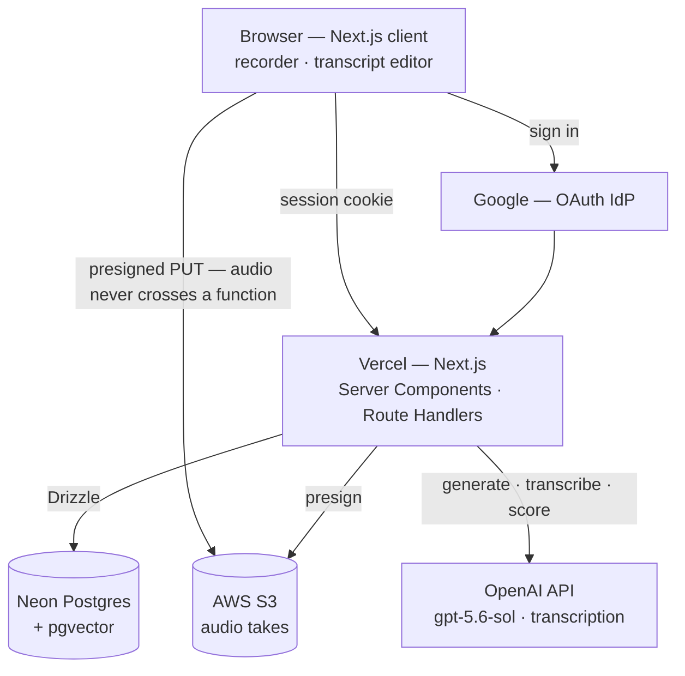

# Technical design & architecture — Suburi

**Date:** 2026-09-12
**Status:** Phase 4. Written against `01-project-brief.md`, `02-product-requirements.md`,
`05-design-system.md`, `10-screen-specifications.md`.

Every constraint in PRD §9 and screen-spec §11 binds this document. Where a technical choice was
made *because* of one of those constraints, it says so — a later session that loses the link will
optimise the constraint away.

---

## 1. Stack

| Layer | Choice | Pinned to |
| --- | --- | --- |
| Frontend | Next.js (App Router) + React, TypeScript | — |
| Styling | Tailwind CSS v4, CSS-first `@theme` | `05` tokens are the only palette |
| UI components | shadcn/ui on Base UI | vendored source in `components/ui/` |
| Backend | Next.js Route Handlers + Server Actions, Node runtime | — |
| ORM | Drizzle | — |
| Database | Postgres 17 + `pgvector` | Neon (prod), Docker (local) |
| Auth | Better Auth, Google IdP only | — |
| Object storage | AWS S3 | one bucket, one prefix |
| Models | OpenAI, `gpt-5.6-sol` | exact string, never an alias |
| Host | Vercel | Hobby to start |

### Why each, and what was rejected

**Next.js.** One deployable that serves both UI and API, first-class on Vercel, and — the reason
that decides it — **React Server Components**. `07` §1 makes reads Server Components, so the round
feedback screen is a Postgres read with no client fetch and no loading state; that is what makes
invariant 2 structural rather than aspirational (§3). The only genuinely stateful client surfaces are
the recorder and the transcript editor. *Rejected:* a separate SPA plus a standalone API, which buys
nothing at one user and costs two deploys; SvelteKit and Nuxt, which have excellent SSR but not the
RSC model the feedback path is built on.

*Corrected 2026-09-13.* This paragraph used to reject Remix and SvelteKit for "a thinner ecosystem
for the auth and ORM choices." That reason was false: Better Auth ships a SvelteKit handler and a Nuxt
integration, and Drizzle has no framework coupling. Nuxt had not been considered at all. Remix's
rejection was not re-examined.

**Tailwind and shadcn/ui, on Base UI.** Tailwind v4's CSS-first `@theme` makes `app/globals.css`
`05` in code, the way `db/schema.ts` is `04`; `--color-*: initial` deletes Tailwind's default palette,
so "no other hue appears anywhere" (`05` §2) is enforced by the build rather than remembered. shadcn
supplies accessible behaviour as vendored source restyled to `05` — the Progress tooltip must be
reachable by keyboard (`05` §7), and the option rows need arrow-key navigation. *Rejected:* no
component library; unstyled primitives without shadcn; shadcn on Radix. The token mapping and the
rules that keep shadcn from becoming a second design system: `05` §10.

**Postgres, not SQLite.** SQLite is genuinely the simpler option and deserves a straight answer.
Three things ruled it out: Vercel Functions have no persistent disk, so SQLite would have forced a
different host or a hosted-SQLite vendor; near-duplicate question detection wants vector search, and
`pgvector` is in the box; and the multi-tenant decision (§2) makes Postgres the safer long-run
floor. At one user, SQLite would have worked — this is a bet on the six-month and product horizons,
not a claim that Postgres is needed today.

**Drizzle.** Better Auth ships a first-class Drizzle adapter, the schema is TypeScript the agents can
read, and migrations are plain SQL files that diff well in review. *Rejected:* Prisma (a second
schema language and a generated client to keep in sync); raw SQL (no type safety across the many
version-stamped columns, which are exactly where a silent mistake would be most expensive).

**OpenAI `gpt-5.6-sol`, pinned.** See §4.

---

## 2. Tenancy and auth posture

**The data model is multi-tenant. The door is shut.**

Every table that holds user data carries `user_id`. There is no invite flow, no role, no sharing
surface, no signup route. Access is Google sign-in with Better Auth's per-provider
`disableSignUp: true`, against a user row seeded by migration — an account not already in the
database cannot be created by signing in.

This reverses PRD §1 as originally written. The PRD and brief have been amended to match rather than
left contradicting the schema; see decision log. What has **not** changed is screen-spec refusal #6:
there is still no sharing surface, no leaderboard and no export-to-anyone, and none should be built.

Detail lives in `08-auth-and-permissions.md`.

---

## 3. Architecture



**The one load-bearing arrow is the direct browser→S3 upload.** A Vercel Function caps request and
response bodies at 4.5 MB, and a four-minute take can exceed that. Audio is PUT straight to S3 with a
short-lived presigned URL; the function only ever handles the resulting object key.

### The round loop, in calls

1. **Round setup** — preflight the OpenAI health check (§5) before the round can start.
2. **Ask** — question read from the bank, or generated and written into it. Realistic mode speaks it.
3. **Record** — `MediaRecorder` in the browser, hard-capped (§7). Blob held locally.
4. **Upload + transcribe** — presigned PUT to S3, then transcription. Raw transcript returned.
5. **Correct** — user edits inline. Raw and corrected both persist; the diff is stored data.
6. **Submit** — the answer row is written, and **scoring is dispatched immediately**, not deferred.
7. **Follow-up** — generated from the corrected answer, asked once, answered through 3–6.
8. Repeat. Realistic mode collects the felt-pressure rating, then renders feedback.

### Scoring runs during the round, not at the end of it

PRD §9 requires round-end feedback to render while the user is still at the machine, and calls a
spinner that outlives the sitting a defect. Scoring sixteen answers in one burst at round end would
put a reasoning model squarely on the critical path.

So each answer is scored the moment it is submitted, while the user is recording the next one. By
round end, fifteen of sixteen scores are already rows in the database and the feedback screen is a
read.

The residual risk is the final answer, which has nothing after it to hide behind — except that the
design already provides a buffer: **screen 7, the felt-pressure rating, sits between the last answer
and the feedback screen** and exists for reasons that have nothing to do with latency. It is
unhurried by design, and it is where the last score lands. Do not "optimise" that screen away or
make it skippable in realistic mode.

---

## 4. Model use

Three distinct jobs, one pinned model:

| Job | Model | Latency budget | Stakes |
| --- | --- | --- | --- |
| Question generation | `gpt-5.6-sol` | before round / between answers | High — banked permanently |
| Follow-up generation | `gpt-5.6-sol` | user is waiting | Low — never scored, never banked |
| Answer scoring | `gpt-5.6-sol` | during the next answer | **The instrument** |

Pricing that drove this (per 1M tokens, verified 2026-09-12): `gpt-6-astra` $10/$50, `gpt-5.6-sol`
$4/$20, `gpt-5.6-terra` $2/$12, `gpt-5.6-luna` $0.20/$1.20. A realistic round is roughly **$0.40 on
Sol**; the 30-day target of eight rounds is a few dollars. **Cost is not a constraint at this
volume, so quality and consistency decided it, not price.**

### Two rules that are not negotiable

**Never point at an alias.** OpenAI's own docs state the `gpt-daybreak-*-latest` aliases will be
repointed at newer models as they ship. An alias in the scoring path would make the six-month chart
measure OpenAI's release schedule. The scoring model is an exact string in config, and changing it
is a migration (§8), not an edit.

**Stamp every AI-touched row.** `model_id`, `prompt_version`, `tokens_in`, `tokens_out` — model and
prompt versioned separately, because the same model with a revised prompt is a different experiment.
The token counts exist so that "which tier is good enough for the money" is answerable later from
data rather than argued from memory.

### Speech-to-text

**`gpt-transcribe`, $0.0045 per minute** (verified 2026-09-12 against the OpenAI pricing and model
pages). Pinned in config alongside the scoring model. The alternatives at the time: `gpt-4o-transcribe`
$0.006, `gpt-4o-mini-transcribe` $0.003, Whisper $0.006. `gpt-transcribe` is both newer and cheaper
than `gpt-4o-transcribe`, and it is the only one of the four that takes **keyword hints and multiple
language hints** — which is the feature this app actually needs, because a Japanese answer about a
Japanese company is exactly the domain-term-plus-code-switching case those hints exist for.

At roughly 24 minutes of audio per round that is **~$0.11 a round**, against ~$0.40 on Sol.
Transcription is a quarter of the model bill and still not a constraint.

**Two things to carry.** `gpt-transcribe` requires **Tier 1 or above** — the Free API tier does not
support it. And its only published snapshot is also called `gpt-transcribe`: there is no dated
snapshot, so the "never point at an alias" rule above **cannot be satisfied here the way it is for
scoring**. The transcription model is therefore stamped on the answer row (`transcriber_model_id`,
`04`) rather than guaranteed stable by the config string, and a silent repoint would show up as a
change in that stamp. Scoring, the actual instrument, is unaffected — invariant 8 governs the scoring
model, and that one is a real pinned string.

The architecture never depended on which model it is: audio reaches transcription from S3, and the raw
transcript is stored verbatim regardless.

### Text-to-speech

Realistic mode speaks the question (decision log, Phase 2); practice mode does not. Synthesis happens
when the question is asked and the audio is not retained — questions are stable bank rows, so
re-synthesis is cheap and caching adds a store to invalidate for no benefit.

---

## 5. External services, and what happens when each is down

| Service | Blast radius | Behaviour |
| --- | --- | --- |
| **OpenAI** | No questions, no transcripts, no scores | Recording and correction still work. **Preflight at round setup** — a round is never started into a broken scorer, because a round that cannot deliver feedback while the user is there is a defect, not a degraded experience. Mid-round failure: scoring retries with backoff; if it still fails, the round completes with scores pending and the feedback screen says so plainly rather than spinning. |
| **S3** | Cannot upload a take | The blob stays in the browser (IndexedDB) and retries. The user is told the take is held locally and must not close the tab. |
| **Neon** | App is down | No mitigation at this scale. Accepted. |
| **Google IdP** | Cannot sign in | An existing session cookie keeps working for its lifetime. |
| **Vercel** | App is down | Accepted. |

A pending score is a first-class state, not an error state — it has a column, and History and
Progress both know how to render it. **Progress excludes pending and failed scores from trend lines
rather than treating them as zero.**

---

## 6. Hosting cost

**At zero users (that is: you, eight rounds a month).** Vercel Hobby $0, Neon free tier $0, S3 under
300 MB ≈ $0, OpenAI ≈ **$3–5/month**. The bill is the model, and it is small.

**At 1,000 users**, if this ever became a product: Vercel Pro from $20/month, Neon on a paid plan,
S3 at roughly 300 GB ≈ $7/month — and OpenAI at 8,000 rounds × ~$0.40 ≈ **$3,200/month**.

That is the finding worth carrying: **model spend dominates infrastructure by two orders of
magnitude at any scale above one user.** If this becomes a product, the economics are an AI-cost
problem and the hosting choice is noise. Nothing about that changes what to build now.

---

## 7. Client state, and what persists

**Server state is Postgres, read through Server Components.** No client-side cache layer, no global
store in v1 — introducing one would be inventing a synchronisation problem the app does not have.

**Client state is two surfaces only:**

- **The recorder** — `MediaRecorder`, elapsed time, the waveform, the local blob. Held in component
  state.
- **The transcript editor** — the edit buffer and the live rewrite-magnitude meter (screen 6).

**A round survives a refresh.** Every answer is written server-side at submit, so the round's
position is a database fact, not a client fact. Reloading mid-round resumes at the current question.
An in-flight recording is the one thing that does not survive, and the UI says so before recording.

**Recording caps.** Realistic mode is capped at 4 minutes per answer and this is specified UI —
screen 4 states `最長 4分` and `4分で自動的に止まります。そこまでの録音は残ります。` Practice mode has
no timer by design, so it gets a **hard 15-minute runaway guard** instead: not a timer, not shown as
pressure, not part of the practice UI's rhythm. It exists so a forgotten open tab cannot produce an
unbounded upload. When it fires it behaves exactly like the realistic cap: the take is kept.

---

## 8. Errors — what the user sees, what gets logged

**Principle: this app has one user, and that user can read. Say what happened.** No generic
"Something went wrong" where a specific sentence is available.

| Failure | User sees | Logged |
| --- | --- | --- |
| Mic permission denied | The browser-level fix, inline on screen 3 | event only |
| Upload failed | "Held on this device. Do not close this tab." + retry | key, size, attempt count |
| Transcription failed | The take is kept; offers retry or typing the answer | answer id, duration |
| Scoring failed | Answer saved, score pending, stated on the feedback screen | answer id, model, error class |
| Model refusal / malformed output | Same as scoring failed | answer id, **not the content** |
| Auth rejected | "This account cannot sign in." No enumeration of why | email hash only |

**Never logged:** transcript text, corrected text, CV text or claims, company notes, prompt bodies,
model response bodies, salary expectations. Logs carry **ids, counts, durations and error classes**.
This is a hard rule — the whole point of §9 is that the sensitive material has exactly two homes,
and a log line is a third.

Scoring retries three times with exponential backoff before a row is marked failed. Failed scores are
retryable from History; a retry is a **new scoring attempt row**, never an overwrite (PRD §9).

---

## 9. Security baseline

**Secrets.** Vercel encrypted environment variables in production; `.env.local`, gitignored, in
development. Never in the repo, never in client bundles. `OPENAI_API_KEY`, `DATABASE_URL`,
`BETTER_AUTH_SECRET`, `GOOGLE_CLIENT_ID`, `GOOGLE_CLIENT_SECRET`, `AWS_ACCESS_KEY_ID`,
`AWS_SECRET_ACCESS_KEY`, `S3_BUCKET`, `ALLOWED_EMAIL`. The AWS credential is a dedicated IAM user
scoped to `PutObject`/`GetObject` on one bucket prefix and nothing else.

**Input validation.** Zod schemas at every Route Handler and Server Action boundary, server-side.
Client validation exists for feedback speed and counts for nothing. Uploads are additionally
constrained at presign time: content type, maximum size, and a server-generated key — **the client
never chooses the object key**.

**Transport.** HTTPS everywhere, enforced by Vercel, with HSTS. No exceptions for local tooling that
is reachable off the machine.

**Sensitive data.** The CV, extracted claims, salary expectations, company notes, every transcript
and every audio take are all sensitive. Encrypted at rest by Neon and by S3 (SSE-S3 minimum). The
bucket blocks all public access; audio is read through short-lived presigned GETs only. Excluded
from logs per §8.

**Dependencies.** Dependabot weekly, plus `npm audit` in CI. Better Auth, Drizzle and the OpenAI SDK
are pinned and upgraded deliberately, not automatically.

**The worst thing an attacker could do.** Not financial — **read the CV, the salary expectations and
the notes on companies being interviewed with.** That is a targeted privacy loss against one
identifiable person, and it is the threat this app actually has. What stops them: no signup path
exists, sign-in is a single allowlisted Google account, every data route requires a session, the
bucket is private with no public objects, and nothing sensitive is in a log.

Second worst: burning the OpenAI key. It is server-side only, never shipped to the client, and the
AI routes are rate-limited per session.

---

## 10. Repo layout

```
suburi/
├── app/
│   ├── (auth)/                sign-in
│   ├── (app)/                 home · round · progress · history · cv
│   └── api/                   route handlers — auth, presign, transcribe, score
├── components/                design-system primitives, per 05
│   └── ui/                    shadcn source on Base UI, vendored and restyled to 05 §10
├── db/
│   ├── schema.ts              Drizzle schema — the 04 doc in code
│   ├── migrations/
│   └── seed.ts                seeded user row, set pieces
├── lib/
│   ├── ai/                    ports: generate · transcribe · score  ← one interface each
│   ├── prompts/               versioned prompt files; the version is in the filename
│   ├── cv/                    claim extraction, span slicing
│   ├── rubric/                rubric versions as data, not prose
│   └── s3/
├── docs/                      01–10, this file among them
└── design/                    Claude Design working files — re-seed from here, never edit the build
```

**`lib/ai/score.ts` is a port with one implementation.** That is deliberate: re-scoring a held-out
set with a different model is the only way to detect scorer drift, and it is impossible if the
scoring call is inlined at its call sites.

---

## 11. The three hardest problems

**1. Proving the instrument is honest — scorer drift.**
The six-month criterion is a trustworthy measurement, not an improved user. If the same answer
scores 3 in March and 4 in September, the chart measures the model. *Plan:* pin the model string;
stamp model, prompt version and token counts on every scored answer; keep a **held-out set of past
answers and re-score it whenever any stamp changes**; have Progress draw a visible boundary at every
stamp change (screen-spec refusal #5). Drift becomes visible rather than silent. This is the
project's central technical risk and it is why `lib/ai/score.ts` is a port.

**2. Grounded CV citation without hallucination.**
Feedback quotes the CV by fragment. A quote of a line you never wrote would destroy trust in the
instrument faster than a wrong score. *Plan:* claims are extracted once per CV version and frozen,
each carrying a character span into immutable stored text; **the rendered quote is sliced from the
stored text by span, never taken from model output.** A model that returns a span outside the
document, or a quote that does not match its span, fails validation and the citation is dropped.
Extraction quality itself is unmeasured — first thing to eyeball on real data.

**3. Near-duplicate questions in a growing bank.**
Generated questions are written into the bank permanently, and first-attempt progress data is keyed
by question id. A bank that accumulates five rephrasings of one question silently fragments the
measurement — five questions with one first attempt each instead of one with five. *Plan:* embed
every question on insert, store the vector in `pgvector`, and check cosine similarity against the
same `(language, round_type)` slice before writing a new row. Above threshold, reuse the existing
question instead of inserting. **The threshold is a guess until there is real data — start strict,
log every near-miss with its score, and tune from the log rather than from intuition.**

---

## 12. Environments

| | Local | Production |
| --- | --- | --- |
| App | `next dev` | Vercel |
| Postgres | Docker Compose, `pgvector` image | Neon |
| Object storage | MinIO, or the real bucket with a `dev/` prefix | S3 |
| Models | Real OpenAI, same pinned strings | Real OpenAI |
| Auth | Better Auth + Google, same allowlist | Same |

Local uses the **same pinned model strings as production**. Testing against a cheaper model would
make local behaviour unrepresentative of the thing being measured.

Full deployment detail is deferred to `12-deployment.md` — see `00-status.md`.
